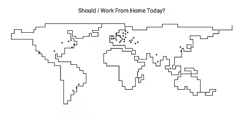

# Valtech Offices Forecast

The website provides forecasts to all Valtech offices around the world. Created using Vuejs, Vuex, Stylus (CSS Preprocessor) and an OpenWeather API. 

 

This website was deployed using Netlify and it's available at https://valtech-offices-forecast.netlify.app/

 

